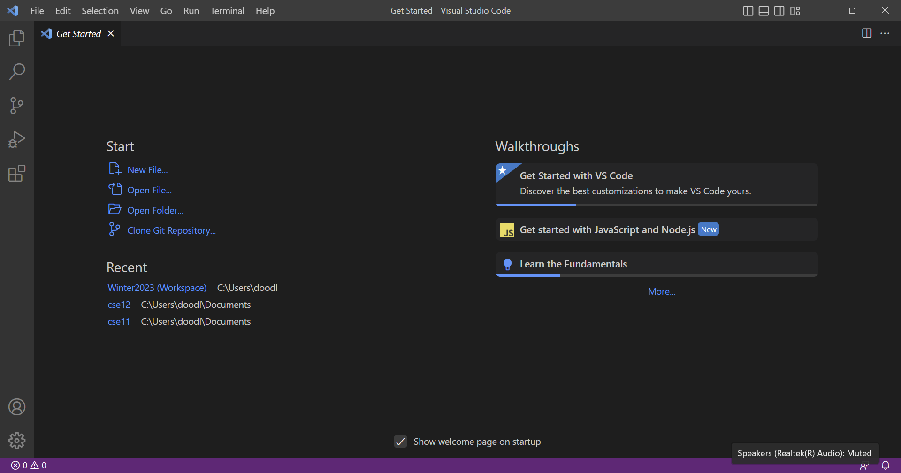

# CSE15L Login Tutorial

## Part 0: Accessing Your CSE15L Course-Specific Account

---------------------------------------------------------

1. Go to [this link](https://sdacs.ucsd.edu/~icc/index.php).

2. Sign in with your school username and Student ID.

3. Find your cse15L account and account username.
> Ex: For Winter 2023, the account username would be cs15lwi23___, where at the end is a personalized random sequence of characters

4. If you need to change your password, go to [this link](https://docs.google.com/document/d/1hs7CyQeh-MdUfM9uv99i8tqfneos6Y8bDU0uhn1wqho/edit).

 
 

## Part 1: Installing VScode (Visual Studio Code)
Note: Skip this if you already have VScode installed

---------------------------------------------------------

1. Download and install [Visual Studio Code](https://code.visualstudio.com/Download) onto your computer.
> Make sure to select the correct version depending on your operating system (Windows, Linux, Mac)

 
 

2. Open up VScode.
> You should see something similar to the screen below
> 

 
 

## Part 3: Remotely Connecting

---------------------------------------------------------

1. If you are on Windows, download and install [Git](https://gitforwindows.org/) onto your computer.

 
 

2. Open the terminal in VScode (Under *terminal* in the upper bar), then open the Command Palette (Under *view* in the upper bar). 

 
 

3. 
