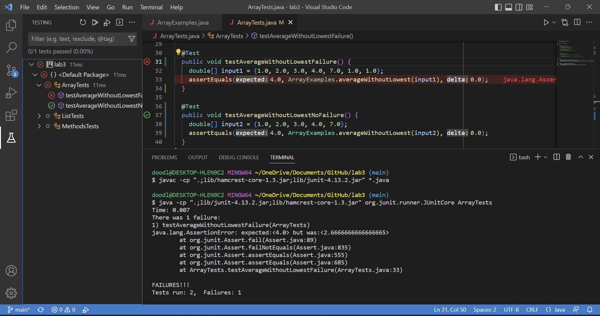

# Week 2 Lab Report

## Part 1: Writing a Web Server

---------------------------------------------------------

The code in StringServer.java
```
import java.io.IOException;
import java.net.URI;

class Handler implements URLHandler {
    String currentString = "";

    public String handleRequest(URI url) {
        if (url.getPath().equals("/")) {
            return "String Builder Website\n" + String.format("Hello, %s", 
                    System.getProperty("user.name"));
        } 
        else if (url.getPath().contains("/add-message")) {
            String[] parameters = url.getQuery().split("=");
            if (parameters[0].equals("s")) {
                if (currentString.equals("")) {
                    currentString += parameters[1];
                }
                else {
                    currentString += "\n" + parameters[1];
                }
                return currentString;
            }
        }
        return "404 Not Found!";
    }
}

class StringServer {
    public static void main(String[] args) throws IOException {
        if(args.length == 0){
            System.out.println("Missing port number! Try any number between 1024 to 49151");
            return;
        }

        int port = Integer.parseInt(args[0]);

        Server.start(port, new Handler());
    }
}
```

<br/> <br/>

The screenshots of using `/add-message`


Screenshot 1:
The method main method is executed when StringServer.java is run on my computer. The main method has the parameter `args`, which takes the arguments in the command prompt. This will be important because the first argument `args[0]` is used to determine the port number for the server. 

In the main method is the method call `Server.start(port, new Handler());`. The start method call is what starts the server, and it takes in two arguments. The first argument is the port number, which, as mentioned before, is taken from the command prompt argument. In this case, I entered 7011 as the server number. The second argument is a new Handler object in order to handle requests in the URL. 

The Handler class has a single method called handleRequest with a URI object `url` as a parameter, and it returns a string to be displayed on the website. The URL passed into the method will be the URL of the website server. The string displayed is determined by what is in the path and query in the URL. 

In order to add a message, the path must include `/add-message` after the domain, followed by the query in the format of `?s=`. The argument that follows the equal sign (the delimiter) is the string that is added to the existing string, and then it is all displayed on the website. In this screenshot, I entered `Hello` as the query argument, and you can see that it is now on the website.

The exact request I typed in was: `http://ieng6-203.ucsd.edu:7011/add-message?s=Hello`

The Handler has a String instance variable `currentString`, which is initially just an empty string. However, every time a message is added through the query in the URL, the variable is updated so that the message string is concatenated to `currentString` on a new line (except for the first time). In this screenshot, because this is the first time a message is added, the string is concatenated without a new line. 

<br/> <br/>


Screenshot 2:
Because the set up of the server such as the port number and calling the server start method is already explained under Screenshot 1, I will go straight to the string argument in the query. In this screenshot, I entered `How are you` as the query argument in the URL. Therefore, the handleRequest takes the string argument and concatenates it to the currentString on a new line. Because the currentString already has `Hello` in it, as seen from the previous screenshot, the entire string displayed on the website is:
```
Hello
How are you
```
The exact request I typed in was: `http://ieng6-203.ucsd.edu:7011/add-message?s=How are you`

<br/> <br/>

## Part 2: Identifying and Fixing Bugs

---------------------------------------------------------

One method that has a bug is the method `averageWithoutLowest()` in the ArrayExamples.java file. The bug occurs when there are multiple doubles that have the lowest value in the input array. This is because the method only accounts for having multiple lowest doubles when adding the doubles together (leaves out all of the lowest doubles), and not when dividing the total by the number of values added to get the average (Always divides by `array length - 1`, which means it only accounts for removing one value). 

The following JUnit tester code demonstrates the bug with a failure-inducing input:
```
  @Test
  public void testAverageWithoutLowestFailure() {
    double[] input1 = {1.0, 2.0, 3.0, 4.0, 7.0, 1.0, 1.0};
    assertEquals(4.0, ArrayExamples.averageWithoutLowest(input1), 0.0);
  }
```
> `input1` has multiple lowest values in its array (three `1.0`s), which means it is a failure-inducing input.

<br/>

The following JUnit tester code does not demonstrate the bug and does not have a failure:
```
  @Test
  public void testAverageWithoutLowestNoFailure() {
    double[] input2 = {1.0, 2.0, 3.0, 4.0, 7.0};
    assertEquals(4.0, ArrayExamples.averageWithoutLowest(input2), 0.0);
  }
```
> `input2` only has one lowest value in its array (one `1.0`), which means it is not a failure-inducing input.

<br/>

The following screenshot demonstrates the two testers being run:

<br/>


> As you can see from the screenshot, the first test with the failure-inducing output states that it `expected:<4.0> but was:<2.6666666666666665>`. If you calculate the average with the bug in mind, you get `(2 + 3 + 4 + 7) / 6`, which does indeed equal 2.66666... (repeating). 

<br/>

Method with Bug:
```
  static double averageWithoutLowest(double[] arr) {
    if(arr.length < 2) { return 0.0; }
    double lowest = arr[0];
    for(double num: arr) {
      if(num < lowest) { lowest = num; }
    }
    double sum = 0;
    for(double num: arr) {
      if(num != lowest) { sum += num; }
    }
    return sum / (arr.length - 1);
  }
```

Method with Bug Fixed:
```
  static double averageWithoutLowest(double[] arr) {
    if(arr.length < 2) { return 0.0; }
    double lowest = arr[0];
    for(double num: arr) {
      if(num < lowest) { lowest = num; }
    }
    double sum = 0;
    int count = 0;
    for(double num: arr) {
      if(num != lowest) { sum += num; }
      else { count++; }
    }
    return sum / (arr.length - count);
  }
```
> The variable `count` is added to keep track of the number of lowest values removed. Count is then subtracted from the array length instead of `1`.

The fixed method works because the added variable `count` is used instead of the constant `1` in order to account for multiple lowest values being removed. In the for loop where the method is adding the doubles in the array, it uses an if statement to determine if the double is the lowest or not. Before the fix, it only used the `(num != lowest)` condition to add the non-lowest values. After the fix, the method now also has an else statement for the if condition that increases the count (of lowest values) by one. By adding `count` and the else statement, the method can now keep track of the number of lowest values. Therefore, when dividing the total sum by the number of values added, the actual number of values added is `arr.length - count` and not `arr.length - 1`. 

<br/> <br/>


## Part 3: Conclusion

---------------------------------------------------------

I learned a lot from both Week 2 and 3, but especially from Week 2. I found it really interesting to learn how a web server can be set up because I had no idea how it worked. I always thought it would be too complicated for me to understand, but seeing the classes and methods needed to set up the server made me realize that it is just code like any other code. I understood all the code in NumberServer.java and was even able to write a part of my own web server, such as the one for this lab report, which I would not have been able to do before. For instance, I learned how the URL's path and query is retrieved through getPath() and getQuery(), as well as how the input(s) after the query are separated using a delimiter and placed into an array to be used. I also took a look at Server.java, and although it was much harder to understand, I still learned about the HttpServer class and how it is used.  


