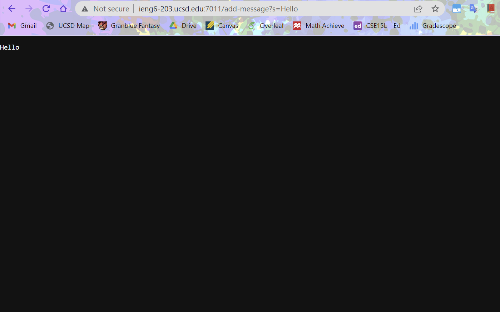
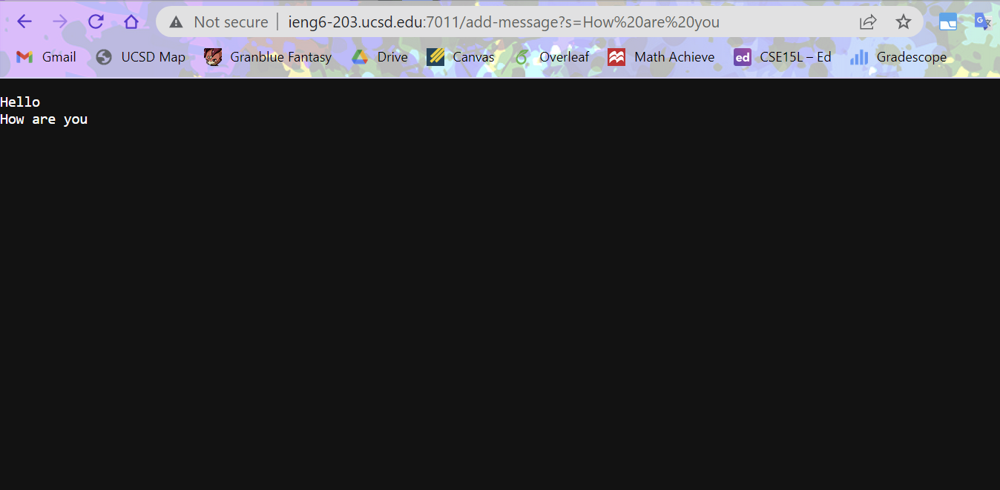

# Week 2 Lab Report

## Part 1: Writing a Web Server

---------------------------------------------------------

The code in StringServer.java
```
import java.io.IOException;
import java.net.URI;

class Handler implements URLHandler {
    String currentString = "";

    public String handleRequest(URI url) {
        if (url.getPath().equals("/")) {
            return "String Builder Website\n" + String.format("Hello, %s", 
                    System.getProperty("user.name"));
        } 
        else if (url.getPath().contains("/add-message")) {
            String[] parameters = url.getQuery().split("=");
            if (parameters[0].equals("s")) {
                if (currentString.equals("")) {
                    currentString += parameters[1];
                }
                else {
                    currentString += "\n" + parameters[1];
                }
                return currentString;
            }
        }
        return "404 Not Found!";
    }
}

class StringServer {
    public static void main(String[] args) throws IOException {
        if(args.length == 0){
            System.out.println("Missing port number! Try any number between 1024 to 49151");
            return;
        }

        int port = Integer.parseInt(args[0]);

        Server.start(port, new Handler());
    }
}
```
The screenshots of using /add-message



Screenshot 1:
The method main method is executed when StringServer.java is run on my computer. The main method has the argument `args`, which takes the arguments in the command prompt. This will be important because the first argument `args[0]` is used to determine the port number for the server. In the main method is the method call `Server.start(port, new Handler());`. The start method call is what starts the server, and it takes in two arguments. The first argument is the port number, which, as mentioned before, is taken from the command prompt argument. In this case, I entered 7011 as the server number. The second argument is a new Handler object in order to handle requests in the URL. The Handler class has a single method called handleRequest that returns a string to be displayed on the website. The string is determined by what is in the path and query in the URL. In order to add a message, the path must include `/add-message`                                         




## Part 2: Identifying and Fixing Bugs

---------------------------------------------------------


## Part 3: Conclusion

---------------------------------------------------------


