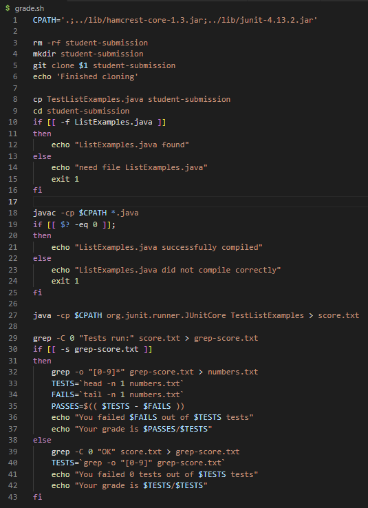

# Lab Report 5

## Week 6: Grading Script



> This is the grading script my partner and I wrote during Week 6! (I made some new changes for this lab report, though)

<br/><br/>

## How the Grading Script Works

```
CPATH='.;../lib/hamcrest-core-1.3.jar;../lib/junit-4.13.2.jar'
```
> This line just stores the JUnit path in a variable so that the code is cleaner to look at

<br/>

```
rm -rf student-submission
mkdir student-submission
git clone $1 student-submission
echo 'Finished cloning'
```
> We probably need to run the grading script multiple times, but we only want one student submission at a time, which is why, if it exists, we delete the previous `student-submission` directory first, then create a new `student-submission` directory right after. 

> We then want to get the actual student submission from GitHub by using `git clone` along with the file name specified in the terminal when running the grading script (stored in the variable `1`). To show that the process was completed, we print `Finished cloning` in the terminal. 

<br/>

```
cp TestListExamples.java student-submission
cd student-submission
if [[ -f ListExamples.java ]]
then 
    echo "ListExamples.java found"
else 
    echo "need file ListExamples.java"
    exit 1
fi
```
> Using the `cp` command on `TestListExamples.java`, we first copy the file that is used to test the student submission into `student-submission`, the same directory as the student submission, to make access simpler. Then, we change the directory to `student-submission` using `cd`.

> Now we need to check whether or not the student submission contains the file we need, and to do this, we use an if statement. We ask if, specifically the file (`-f`), `ListExamples.java` exists in the directory, and if it does, we print `ListExamples.java found` in the terminal. If it does not exist, then we print `need file ListExamples.java`, and then we terminate the script with exit code 1 due to the missing file. 

<br/>

```
javac -cp $CPATH *.java 
if [[ $? -eq 0 ]];
then 
    echo "ListExamples.java successfully compiled"
else 
    echo "ListExamples.java did not compile correctly"
    exit 1
fi
```
> Now, with the first line, we run the command of compiling the JUnit tester, which checks for errors in both the JUnit tester and the files that the JUnit is testing (this is why we do not need to compile `ListExamples.java` before we compile the JUnit tester). If there are any compile issues, they would also be printed in the terminal. 

> If the command is successful, it will return an exit code of 0, but if it fails it will return an exit code of 1. Therefore, we can check if we successfully compiled the file or not by checking the returned exit code. The exit code of the most recent command that was run is always stored in the variable `?`, so we check if the exit code is equal to (`-eq`) 0. If the exit code is equal to 0 that means the compile was successful and there was no error, and we print `ListExamples.java successfully compiled` in the terminal. If the exit code is not equal to 0, that means the compile was not successful, and we print `ListExamples.java did not compile correctly` in the terminal. Then, we terminate the script with exit code 1 due to the unsuccessful compile. 

<br/>

```
java -cp $CPATH org.junit.runner.JUnitCore TestListExamples > score.txt
```
> Now we actually run the JUnit tester `TestListExamples` and save the output in a text file called `score.txt`.

<br/>


```
grep -C 0 "Tests run:" score.txt > grep-score.txt
```
> First, we need to get the line that shows how many tests have failed. If there was a failed test, then the JUnit output would have the line `Tests run: __,  Failures: __`, where there would be numbers in place of the `__`. Therefore, we use grep to search for the `Tests run:` line and then save the output in a text file called `grep-score.txt`. The option `-C 0` means context 0, in which context refers to the lines before and after the matching line. Context 0 ensures that we get only the line that has the matching text. 

<br/>

```
if [[ -s grep-score.txt ]]
then
    grep -o "[0-9]*" grep-score.txt > numbers.txt
    TESTS=`head -n 1 numbers.txt`
    FAILS=`tail -n 1 numbers.txt`
    PASSES=$(( $TESTS - $FAILS ))
    echo "You failed $FAILS out of $TESTS tests"
    echo "Your grade is $PASSES/$TESTS"
```
> Next, we check test `-s` to check whether or not `grep-score.txt` is empty (returns true if file exists and is not empty),  which determines whether or not the student passed all their tests or not. This is because if all the tests pass, the output will not contain the text `"Tests run:"`, which means `grep-score.txt` should be empty. 

> Therefore, if `grep-score.txt` is not empty, then we want to get the numbers from the test to see how many tests we failed. We can do this by using grep again with `-o "[0-9]*"` and then saving the output in a text file called `number.txt`. The option `-o` refers to only-matching, which means only the text that matches will be output. The option `"[0-9]*"` is a pattern that identifies any number, and the `*` at the end means the pattern can occur multiple times. 

> Each number found in `grep-score.txt` should be output on a new line in `numbers.txt`, which means we can then use the `head` and `tail` commands to get the two numbers individually. Based on the formatting, the first number would be the number of tests, so we use `head -n 1 numbers.txt` to save that value in the variable `TESTS`. The option `-n 1` ensures that the number of lines output is only 1 (the head itself). The second number would be the number of failed tests, so we use `tail -n 1 numbers.txt` to save that value in the variable `FAILS`. Again, the option `-n 1` ensures that the number of lines output is only 1 (the tail itself). 

> We then want to find the number of tests passed, so we calculate the difference between the total number of tests and the number of failed tests using arithmetic expansion in bash and save the value in the variable `PASSES`.

> Finally, we print out the results of the tests in the terminal, showing how many tests failed out of the total number of tests, as well as the grade in fraction form. 

<br/>

```
else 
    grep -C 0 "OK" score.txt > grep-score.txt
    TESTS=`grep -o "[0-9]" grep-score.txt`
    echo "You failed 0 tests out of $TESTS tests"
    echo "Your grade is $TESTS/$TESTS"
fi
```
> If `grep-score.txt` is empty, then that means the student passed all of the tests. We still want to get the number of total tests, so instead of looking for `"Tests run:"`, we look for `"OK"` because if all the test pass, the JUnit output would have the line `OK (__ tests)`, where there would be a number in place of the `__`. That's why we do `grep -C 0` again but for `"OK"`, and we just overwrite the previous grep-score.txt file with the new output. 

> Next, similar to the process described above, we use `grep -o "[0-9]"` on grep-score.txt to get the number of total tests. Because there should only be one number this time, we do not need the `*` after `[0-9]`. Another difference because there should only be one number is that we can just directly save the grep output in the variable `TESTS`. 

> Finally, we print out the results of the tests in the terminal, showing how many tests failed out of the total number of tests (always fail 0 tests), as well as the grade in fraction form (fraction will always equal 1). 

<br/><br/>

## Showing That the Grading Script Actually Does Work

Now that the explanation is finally over, let's get to testing some files!

<br/>

In the Week 6 Lab, we were provided with GitHub repositories to run through grading script, so I will show the results here.
Note: I have two tests in my test file, `TestListExamples.java`, one I wrote myself to test the filter method, and the other one was given originally to test the merge method. The test file can be seen below:
> 

<br/>

## The Tests

<br/>

[list-methods-lab3](https://github.com/ucsd-cse15l-f22/list-methods-lab3)
> 


<br/>

[list-methods-corrected](https://github.com/ucsd-cse15l-f22/list-methods-corrected)
> 


<br/>

[list-methods-compile-error](https://github.com/ucsd-cse15l-f22/list-methods-compile-error)
> 


<br/>

[list-methods-signature](https://github.com/ucsd-cse15l-f22/list-methods-signature)
> 


<br/>

[list-methods-filename](https://github.com/ucsd-cse15l-f22/list-methods-filename)
> 


<br/>

[list-methods-nested](https://github.com/ucsd-cse15l-f22/list-methods-nested)
> 


<br/>

[list-examples-subtle](https://github.com/ucsd-cse15l-f22/list-examples-subtle)
> 

<br/>

These should be the correct results for each of the repositories!

<br/><br/>

## Considerations for Future Changes

One thing I would definitely change if I had more time is the test result output. If you normally run JUnit, the output also includes exactly which tests failed, and exactly how the test failed so that the student will know what they need to fix, but my current grading script does not include that. One way I could implement this is just by including the JUnit command to run `TestListExamples` without redirecting the output, which would then print all the information to the terminal. However, it would be much better if I could only get the part that says which test failed and how it failed, and this would probably involve more greps. 
<br/>
Another thing I would want to change is to make the grading script universal for the test file as well. Instead of explicitly putting in `TestListExamples.java` in the grading script, I would put `$2` instead so that it is possible to specify which test file to use in the terminal, just like for the student submission. 
<br/>
Finally, the grade output is currently in fraction form, but it would be nice to put the grade in percent form too. The issue is that this would involve floats, but bash arithmetic expansion can only return integers. Therefore, I would need another method to do operations in bash that can calculate floats. 

## Closing Statement

As this is the last lab report, 


